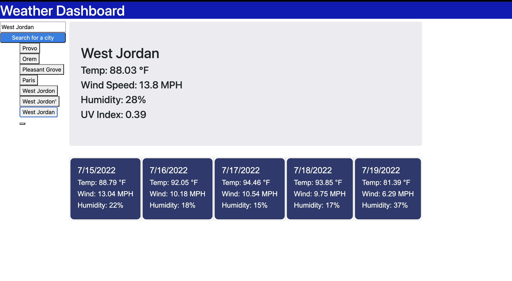

# WeatherDashboard_AC
# Work Day Scheduler Starter Code

This project is a weather dashboard which used the OpenWeather One Call API to retrieve wweather data for cities. Previously searched cities will be stored via local storage to be searched again. 

## Acceptance Criteria

* Presents current and future weather conditions for a city

* Presents the city name, date, an icon of the weather representation, temperature, humidity, wind speed and UV Index.

* shows a 5 day forcast that displays the date, icon, temp, wind speed and humidity.

* cities are stored in a local search history and can display current and future conditions when selected.

The following image demonstrates the web application's appearance and functionality:

Website URL: https://acorbridg.github.io/WeatherDashboard_AC/